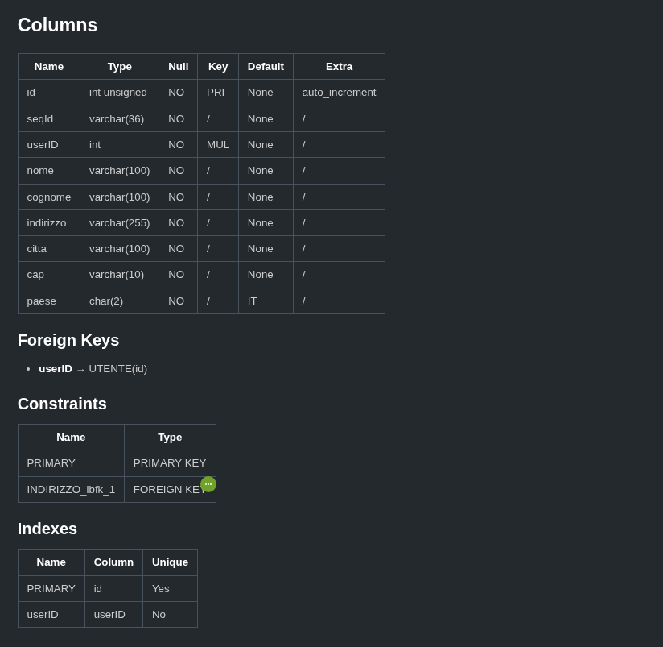

# Overview

This simple python tool helps to create an agent friendly markdown file from relational local database

## Installation

`pip install git+https://github.com/Bilodev/dbtomd.git`

## Usage

```bash
export DB_USR="username"
export DB_PSW="password"
dbtomd db_type db_name output_file mode(default=1)
```

This tool supports:

- `db_type="mysql"`
- `db_type="sqlite"` (note that here database username and password are negligible, anyway they must be set.)

## Output

In the output file, for each table, there will be a "summary" like this:


